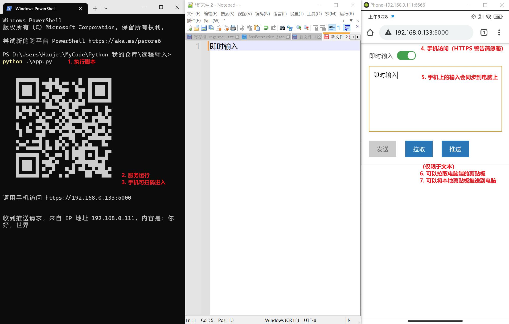

网页端的远程输入

## 用途

在电脑端运行脚本后，会生成一个简单的 http 服务，然后用手机端访问，会打开一个页面，在这个页面输入文字，然后就可以把输入的文字同步到电脑端。

主要用于在手机端使用语音输入，同步输到电脑上，多一种输入方式。

有两种输入模式：

- 刚打开页面，是发送模式。在文本框中输入文本，然后点击「发送」，在电脑端就会打出这些字。
- 打开「即时输入」开关，然后「发送」按钮会变灰，此时在文本框中输入文本，电脑端会同步打字、同步删减。

此外还可以用于同步剪贴板，有两个按钮：

- 获取：将「服务端的剪贴板」复制到「本地剪贴板」
- 推送：将「本地的剪贴板」上传到「服务端剪贴板」

## 使用方法

这是 python 脚本，先安装依赖：

```
pip install -r requirements.txt
```

然后在终端打开文件夹，执行 `python app.py` 运行脚本后，用手机端访问电脑的这个端口就可以了。





使用视频：

https://raw.githubusercontent.com/HaujetZhao/web_remote_input/master/assets/%E4%BD%BF%E7%94%A8%E8%A7%86%E9%A2%91.mp4

## 问题

### SSL 自签名证书

由于获取剪贴板和设置剪贴板的 API 均需要 HTTPS ，因此只得设置自签名证书，客户端会提示 https 不安全，需要手动信任。此外，在服务端会出现关于客户端 SSL 证书认证失败的报错，我有没找到关闭这个报错的办法，只能把 stderr 关了糊弄过去，反正也不影响使用。

### iOS 端语音实时输入

iOS 端原生输入法的语音输入，在「即时输入」模式下有问题，以我的技术能力暂无法解决，我可以监测到一系列的 `insertText` 事件，但没有收到任何 `deleteContentBackward` 事件，然而，输入框中的文本的表现是之前输入的文本被更新了。

当我用语音输入说 「快速地飞过。」 时，这是事件记录：

```
before_input_event: {'inputType': 'insertText', 'data': '快', 'targetValue': ''}
input_event: {'inputType': 'insertText', 'data': '快', 'targetValue': '快'}

before_input_event: {'inputType': 'insertText', 'data': '快速', 'targetValue': '快'}
input_event: {'inputType': 'insertText', 'data': '快速', 'targetValue': '快速'}

before_input_event: {'inputType': 'insertText', 'data': '快速。', 'targetValue': '快速'}
input_event: {'inputType': 'insertText', 'data': '快速。', 'targetValue': '快速。'}

before_input_event: {'inputType': 'insertText', 'data': '快速的。', 'targetValue': '快速。'}
input_event: {'inputType': 'insertText', 'data': '快速的。', 'targetValue': '快速的。'}

before_input_event: {'inputType': 'insertText', 'data': '快速地飞过。', 'targetValue': '快速的。'}
input_event: {'inputType': 'insertText', 'data': '快速地飞过。', 'targetValue': '快速地飞过。'}

before_input_event: {'inputType': 'insertText', 'data': '快速地飞过。', 'targetValue': '快速地飞过。'}
input_event: {'inputType': 'insertText', 'data': '快速地飞过。', 'targetValue': '快速地飞过。'}
```

根据这些事件，如果同步到电脑端，则输出会是 「快快速快速。快速的。快速地飞过。快速地飞过。」。然而，实际手机端输入框中的文本是 「快速地飞过。」。

我的猜想是，可能有我没有捕获到的其他事件，允许语音输入直接覆盖之前输入的文本。

这个问题我暂时无力解决。

不过 ios 端可以在「即时输入」模式下正常使用百度输入法的语音输入。
